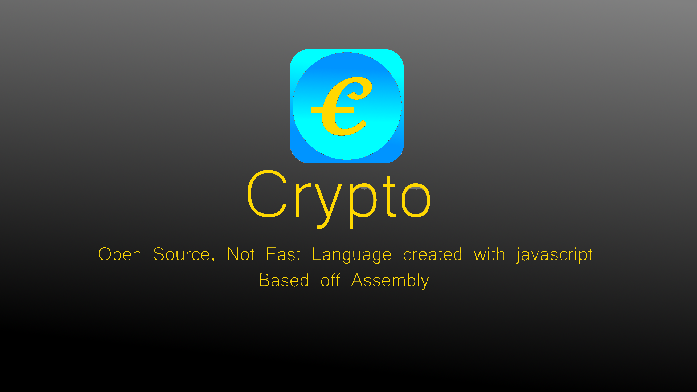

[](https://github.com/maxjackson2/crypto/actions/workflows/ci.yml) 
[](https://github.com/maxjackson2/crypto/actions/workflows/npm-publish.yml)

# crypto
Not fast, Open Source Language created with javascript based off assembly.

# Examples
All Examples can be seen in the examples folder or select a example from this list:
 - [Positioning a address](./examples/positions.crypto)
 - [Setting the current address value](./examples/setting.crypto)
 - [Printing the current address value to a character](./examples/printing.crypto)
 - [Getting the current address value](./examples/get.crypto)
 - [Adding to the current address value](./examples/add.crypto)
 - [Clearing the Memory](./examples/clear.crypto)
 - [Comments](./examples/comments.crypto)
 - [Decrement the current address value](./examples/decrement.crypto)
 - [Increment the current address value](./examples/increment.crypto)
 - [Moving Addressess](./examples/mov.crypto)
 - [Sections](./examples/section.crypto)
 - [Looping](./examples/loop.crypto)

# Building the project
Download the project and run these commands:  
-  Packages Installation:
    ```sh
    npm run crypto:install
    ```
- Build the project:
    ```sh
    # For Windows use
    npm run crypto:build:win
    # For linux Unix, Linux, BSD, macOS, and Cygwin use
    npm run crypto:build:sh
    ```
- or Download the cli using npm:
    ```sh
    npm install -g crypto-lang-cli
    ```
    and run:
    ```sh
    # This builds for every system so don't worry.
    crypto-cli -git -install -build
    ```

# License and Author
This project current license is **MIT**.  
**Author**: Max Jackson